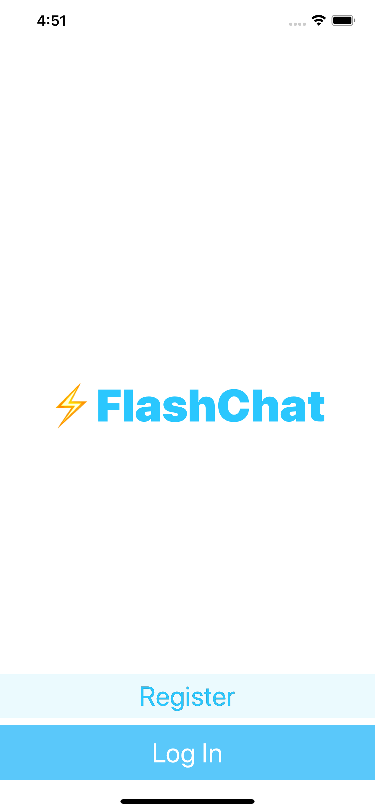
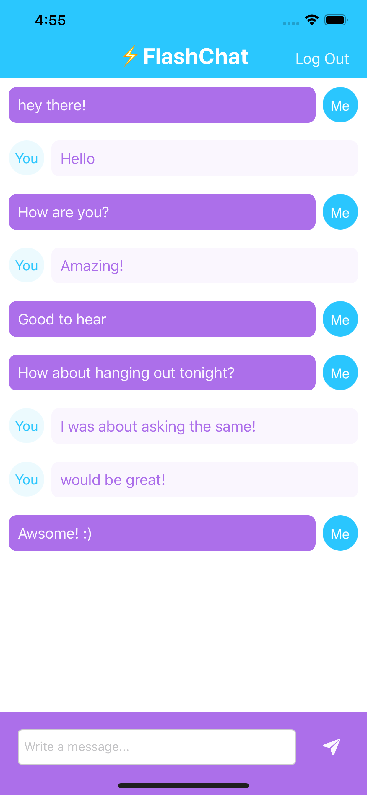

# FlashChat
Chat application

Copy Rights:
Flash Chat App provided by Angela from *iOS 13 & Swift 5 - The Complete iOS App Development Bootcamp* from Udemy. 
Angela is iOS swift teacher that teaches people app development with Swift programing language.

link to the Udemy course : https://www.udemy.com/course/ios-13-app-development-bootcamp/

About the app:

   

This is a basic chat room that can be used by anyone who registrating the app.
the registration, data saving, data fetching, user managing, user logging, all of these are workign by Firebase.

By registration we creating a new account on firebase.

By logging we accessing the users database to see if this user exixts. if does, it logs into the user.

The messages are sender related. each message has a sender property witch allows us to modify the message cell currectly to the right user.
Each message cell has its own design, so we see what messages were sent by us, and what messages ware sent to us from another side.

Messages data are realtime database, witch modifies at any change of the content. each message right after sending, added right away to the tableView by firebase database listener.

all firebase implementation were added via Cocoapods.
as the firebase an other pod was added to this project called: IQKeyboardManager, witch is helping with keyboard managing.
all configuration for IQKeyboardManager pod are in the AppDelegate.swift file with the firebase configurations.

NOTE: All firebase pods are not included in the repository, as well as other pods that were used in the project.
